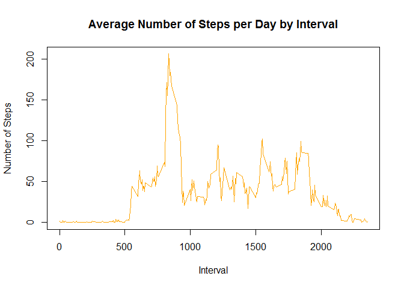
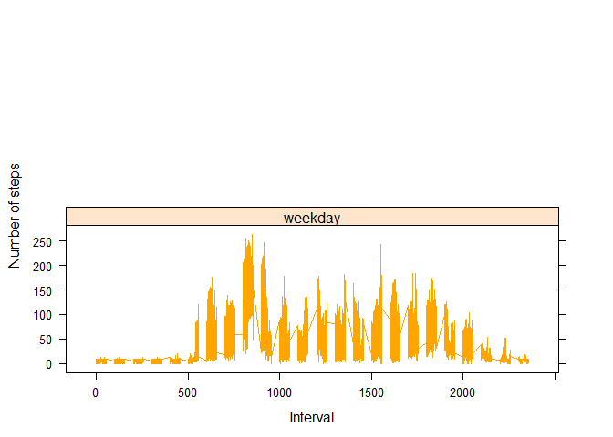

# Reproducible Research: Peer Assessment 1
The assignment makes use of the data from a personal activity monitoring device. This device collects data at 5 minute intervals through out the day. The data consists of two months of data from an anonymous individual collected during the months of October and November, 2012 and include the number of steps taken in 5 minute intervals each day.

The dataset is stored in a comma-separated-value (CSV) file and there are a total of 17568 observations in it.

The assignment report will provide answers to the issues detailed below.


## Loading and preprocessing the data
1. Set R working directory using using the setwd() function.

2. For loading the data stored in the csv file in the working directory with the read.csv() function:

```r
# Load the raw activity data
data <- read.csv("activity.csv")
```

## What is mean total number of steps taken per day?

For this part of the assignment we ignore the missing values in the dataset.

1. Calculate the total number of steps taken per day:

```r
steps_by_day <- aggregate(steps ~ date, data, sum)
```

2. Show number of steps taken per day:

```r
steps_by_day
```

```
##          date steps
## 1  2012-10-02   126
## 2  2012-10-03 11352
## 3  2012-10-04 12116
## 4  2012-10-05 13294
## 5  2012-10-06 15420
## 6  2012-10-07 11015
## 7  2012-10-09 12811
## 8  2012-10-10  9900
## 9  2012-10-11 10304
## 10 2012-10-12 17382
## 11 2012-10-13 12426
## 12 2012-10-14 15098
## 13 2012-10-15 10139
## 14 2012-10-16 15084
## 15 2012-10-17 13452
## 16 2012-10-18 10056
## 17 2012-10-19 11829
## 18 2012-10-20 10395
## 19 2012-10-21  8821
## 20 2012-10-22 13460
## 21 2012-10-23  8918
## 22 2012-10-24  8355
## 23 2012-10-25  2492
## 24 2012-10-26  6778
## 25 2012-10-27 10119
## 26 2012-10-28 11458
## 27 2012-10-29  5018
## 28 2012-10-30  9819
## 29 2012-10-31 15414
## 30 2012-11-02 10600
## 31 2012-11-03 10571
## 32 2012-11-05 10439
## 33 2012-11-06  8334
## 34 2012-11-07 12883
## 35 2012-11-08  3219
## 36 2012-11-11 12608
## 37 2012-11-12 10765
## 38 2012-11-13  7336
## 39 2012-11-15    41
## 40 2012-11-16  5441
## 41 2012-11-17 14339
## 42 2012-11-18 15110
## 43 2012-11-19  8841
## 44 2012-11-20  4472
## 45 2012-11-21 12787
## 46 2012-11-22 20427
## 47 2012-11-23 21194
## 48 2012-11-24 14478
## 49 2012-11-25 11834
## 50 2012-11-26 11162
## 51 2012-11-27 13646
## 52 2012-11-28 10183
## 53 2012-11-29  7047
```

3. Making a histogram of the total number of steps taken each day:

```r
hist(steps_by_day$steps, main = paste("Total Steps Each Day"), col="blue", xlab="Number of Steps")
```

 

4. Calculating and reporting the mean and median of the total number of steps taken per day:

```r
# The mean
rmean <- mean(steps_by_day$steps)

# The median
rmedian <- median(steps_by_day$steps)

# The mean is:
rmean
```

```
## [1] 10766.19
```

```r
# The median is:
rmedian
```

```
## [1] 10765
```


## What is the average daily activity pattern?

1. Make a time series plot (i.e. type = "l") of the 5-minute interval (x-axis) and the average number of steps taken, averaged across all days (y-axis)

```r
# To calculate the average number of steps for each interval for all days:
steps_by_interval <- aggregate(steps ~ interval, data, mean)
```

To display the first few rows of the mean_data data frame:

```r
head(steps_by_interval)
```

```
##   interval     steps
## 1        0 1.7169811
## 2        5 0.3396226
## 3       10 0.1320755
## 4       15 0.1509434
## 5       20 0.0754717
## 6       25 2.0943396
```

The following code creates the time serie plot:

```r
plot(steps_by_interval$interval,steps_by_interval$steps, type="l", xlab="Interval", col="orange", ylab="Number of Steps",main="Average Number of Steps per Day by Interval")
```

 

2. Which 5-minute interval, on average across all the days in the dataset, contains the maximum number of steps?:

```r
max_interval <- steps_by_interval[which.max(steps_by_interval$steps),1]

# The 5-minute interval that contains the maximum of steps, on average, across all days is
max_interval
```

```
## [1] 835
```


## Imputing missing values

1. Missing data needed to be imputed. Only a simple imputation approach was required for this assignment. Missing values were imputed by inserting the average for each interval. Thus, if interval 10 was missing on 10-02-2012, the average for that interval for all days (0.1320755), replaced the NA.


```r
incomplete <- sum(!complete.cases(data))
imputed_data <- transform(data, steps = ifelse(is.na(data$steps), steps_by_interval$steps[match(data$interval, steps_by_interval$interval)], data$steps))
```

2. Zeroes were imputed for 10-01-2012 because it was the first day and would have been over 9,000 steps higher than the following day, which had only 126 steps. NAs then were assumed to be zeros to fit the rising trend of the data.

```r
imputed_data[as.character(imputed_data$date) == "2012-10-01", 1] <- 0
```

3. Recount total steps by day and create Histogram

```r
steps_by_day_i <- aggregate(steps ~ date, imputed_data, sum)
hist(steps_by_day_i$steps, main = paste("Total Steps Each Day"), col="blue", xlab="Number of Steps")

#Create Histogram to show difference. 
hist(steps_by_day$steps, main = paste("Total Steps Each Day"), col="red", xlab="Number of Steps", add=T)
legend("topright", c("Imputed", "Non-imputed"), col=c("blue", "red"), lwd=10)
```

 

The new mean and median are computed like this:

```r
rmean.i <- mean(steps_by_day_i$steps)
rmedian.i <- median(steps_by_day_i$steps)
```

Calculate difference between imputed and non-imputed data:

```r
mean_diff <- rmean.i - rmean
med_diff <- rmedian.i - rmedian
```

Calculate total difference:

```r
total_diff <- sum(steps_by_day_i$steps) - sum(steps_by_day$steps)
```

* The imputed data mean is:

```r
rmean.i
```

```
## [1] 10589.69
```

* The imputed data median is:

```r
rmedian.i
```

```
## [1] 10766.19
```

* The difference between the non-imputed mean and imputed mean is:

```r
mean_diff
```

```
## [1] -176.4949
```

* The difference between total number of steps between imputed and non-imputed data is:

```r
total_diff
```

```
## [1] 75363.32
```

Thus, there were more steps in the imputed data:

```r
total_diff
```

```
## [1] 75363.32
```

## Are there differences in activity patterns between weekdays and weekends?

Creating a plot to compare and contrast number of steps between the week and weekend. There is a higher peak earlier on weekdays, and more overall activity on weekends:

```r
weekdays <- c("Monday", "Tuesday", "Wednesday", "Thursday", 
              "Friday")
imputed_data$dow = as.factor(ifelse(is.element(weekdays(as.Date(imputed_data$date)),weekdays), "Weekday", "Weekend"))

steps_by_interval_i <- aggregate(steps ~ interval + dow, imputed_data, mean)

library(lattice)

xyplot(steps_by_interval_i$steps ~ steps_by_interval_i$interval|steps_by_interval_i$dow, main="Average Steps per Day by Interval",xlab="Interval", ylab="Steps",layout=c(1,2), type="l")
```

 
